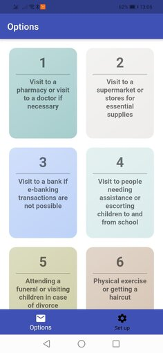

# Covid Helper

A simple project, written in Flutter, that helps people living in Greece send the required SMS to go outside

## Basic Idea

During the lockdown in Greece the only way to get outside was to send a message with a number that described the reason
you are going outside, your name and you address.

## User Interface

In this simple app you just set up your name and address, and then you tap the reason you want to go outside, and it
sends an SMS automatically for you.
